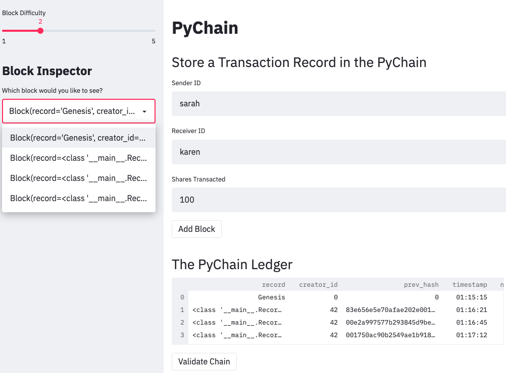
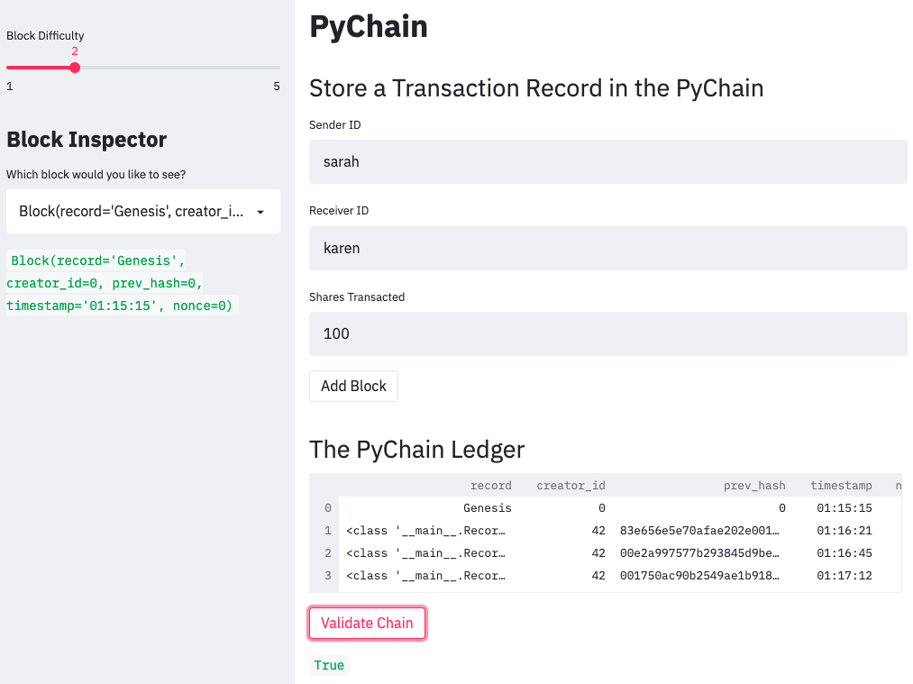
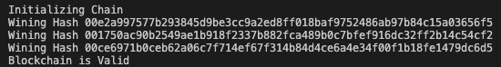

# Pychain_Ledger

Build a blockchain-based ledger system, complete with a user-friendly web interface. This ledger should allow partner banks to conduct financial transactions (that is, to transfer money between senders and receivers) and to verify the integrity of the data in the ledger.

* Create a new data class named Record. This class will serve as the blueprint for the financial transaction records that the blocks of the ledger will store.

* Change the existing Block data class by replacing the generic data attribute with a record attribute that’s of type Record.

* Create additional user input areas in the Streamlit application. These input areas should collect the relevant information for each financial record that you’ll store in the PyChain ledger.

* Test your complete PyChain ledger.

## Instructions
* Create a Record Data Class

* Modify the Existing Block Data Class to Store Record Data

* Add Relevant User Inputs to the Streamlit Interface

* Test the PyChain Ledger by Storing Records

1. Create a Record Data Class
    * Define a new class named Record.

    * Add the @dataclass decorator immediately before the Record class definition.

    * Add an attribute named sender of type str.

    * Add an attribute named receiver of type str.

    * Add an attribute named amount of type float.

2. Modify the Existing Block Data Class to Store Record Data
    * In the Block class, rename the data attribute to record.

    * Set the data type of the record attribute to Record.

3. Add Relevant User Inputs to the Streamlit Interface
    * Delete the input_data variable from the Streamlit interface.

    * Add an input area where you can get a value for sender from the user.

    * Add an input area where you can get a value for receiver from the user.

    * Add an input area where you can get a value for amount from the user.

    * As part of the Add Block button functionality, update new_block so that Block consists of an attribute named record, which is set equal to a Record that contains the sender, receiver, and amount values. The updated Blockshould also include the attributes for creator_id and prev_hash.

4. Test the PyChain Ledger by Storing Records
    * In the terminal, navigate to the project folder where you've coded the Challenge.

    * In the terminal, run the Streamlit application by using streamlit run pychain.py.

    * Enter values for the sender, receiver, and amount, and then click the Add Block button. Do this several times to store several blocks in the ledger.

    * Verify the block contents and hashes in the Streamlit drop-down menu. Take a screenshot of the Streamlit application page, which should detail a blockchain that consists of multiple blocks. Include the screenshot in the README.md file for your Challenge repository.

    * Test the blockchain validation process by using the web interface. Take a screenshot of the Streamlit application page, which should indicate the validity of the blockchain. Include the screenshot in the README.md file for your Challenge repository.

